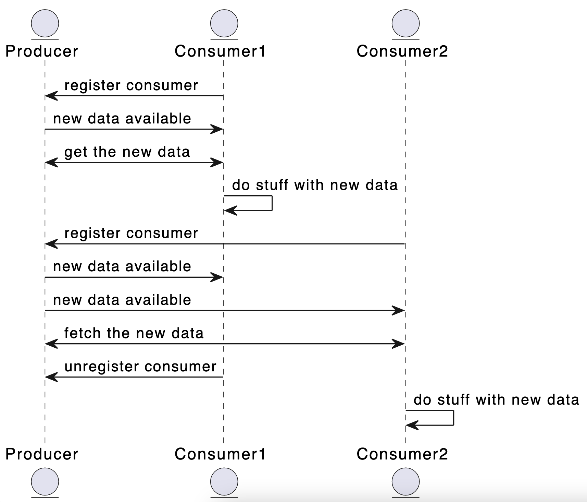

# Exercise 3: Multiple Class Interaction

In this exercise, we will be building a relatively complexe system that consists of serveral classes that need to coordinate certain events. In the process, we introduce the concept of asynchronicity, generators, parallellism and message queues. The central idea is that we have some data that needs to be harvested, transformed and distributed. We build this application in several more or less independent steps, in order to bring the idea home that seperation and compartmentalization are good things.

## Step 1: Producing data

Download [the file dSST.csv](files/dSST.csv) and study its contents. This is a comma-seperated datafile consisting of the average monthly global temperature anomalies between the years 1880-2021. These temperatures are based on the GISS Surface Temperature Analysis (GISTEMP v4), an estimate of global surface temperature change. Anomalies are defined relative to a base period of 1951-1980.

### 1a: from csv to json

We want this data to be made available in json instead of csv. The big difference between these two date formats is that the first line of a csv-file contains all the properties (*keys*) of the data, while json needs to have these properties repeated. Have a look at the following example:

```csv
key1,key2
1880,3.14
1881,2.87
```

which in json would be

```json
[{"key1":1880,"key2":3.14},{"key1":1881, "key2":2.87}]
```

Create a class `CsvConverter` which does exactly this. Make sure that when you create an instance of this class, the *header* (first line) of a csv-file is added. Since this is usually just a string, make sure to split this line using `str.split(',')` in order to create a list of keys. 

Add a method `csv_to_json()` which receives a list of lines from a csv-file and returns this data as json. Again, since the lines are just strings, use `split` to transform each line into a list of values. Make sure that the amount of items in each line corresponds to the number of elements in the header that you stored in the object (make us of `assert` and issue a nice warning when the numbers don't match). Use the following code as an example for your implementation:

```ipython
>>> keys = 'a,b,c,d'
>>> vals = '3,2,1,5'
>>> dict(zip(keys.split(','), vals.split(',')))
{'a': '3', 'b': '2', 'c': '1', 'd': '5'}
>>> 
```

You may need to use `json.dumps()` in your method to make sure that the returned value is indeed valid json (past it into [jsonparser.org](https://jsonparser.org/) when in doubt).

### 1b. getting the data

Create a class `Reader` which gets the location of a csv-file in its constructor (you might want to default this to our `dSSST.csv`). Also in the constructor, create an instance of the `CvsConcerter` and store that in the object's memory space. `Reader`-objects will read the given csv-files in strides of a certain amount of lines. In order to do this, you will need to do some bookkeeping within the object itself: you will need to store both the number of lines that are read in one go and also a pointer to the current line in the file. 

Add a method `get_lines()` to the `Reader`-class. In this method, the next stride of lines is returned as json. You can use [`linecache`](https://docs.python.org/3/library/linecache.html) to read certain lines of the data-file. So, given that the first line of our csv-file contains its keys, a flow could be like this (output omitted for readability):

```python
red = Reader('dSST.csv')
red.get_lines() #returns lines 2-6 as json
reg.get_lines() #returns lines 7-11 as json
reg.get_lines() #returns lines 12-16 as json
```

If there are no more lines in the data-file, the method `get_lines()` needs to return an empty string.

## Step 2: Consuming the data

We are going to create two classes, `AverageYear` and `AverageMonth` that make use of this temperature-data that is being provided by objects of the `Reader`-class. There are, of course, several ways in which you can make these `Reader`-objects available in the consuming classes: we can create a new `Reader`-object when initializing our consumer, or we can make one `Reader`-object and give that object to the initializer of the consumers. What do you think are the pros and cons of both approaches?

The first consuming class will show the *average temperature anomaly* for the complete set of five years that our `Reader` is returning. the second class needs to show the *average montly anomaly* for the same five years. Please note that the number of columns is *larger* than the number of months within the year (the last few columns are some kind of special meteorological averages), so be sure to take the right data. Of course, in both classes you can make use of pandas, numpy, matplotlib and all kind of libraries you are used to in order to make some sort of visualisation.

Within both classes, use consecutive calls to `get_lines()` in order to get the next stride of lines from this data-class. Stop calling this method whenever this method returns an empty string. You don't *need* to make an incremental plot with each new call to `get_lines()` (thought that would be a nice addition): it is sufficient when you repaint your visualisation every time new data gets returned.

In the end, the architecture would look as follows:


There are several issues with this architecture, regardsless of the way in which you provided the consuming classes with the `Reader`-objects. In the following step, we are going to decouple these classes in order to create a more robust and versatile system.

## Step 3: The observer pattern

During the theoretical part, the observer pattern was briefly described. For easy reference, the sequence diagram that was shown is repeated here:



In this step, we are going to refactor the classes you've created in step 3 in order to realise this design pattern.

### 3a: Extending the reader

Create two methods in the `Reader`-class, `add_observer()` and `remove_observer()` so that we can add and remove observers. Make sure that when we create a new instance of the `Reader`, you create an empty *set* within the memory-space of the `Reader`. A call to the first method should add the given observer to this list, a call to the second call will (drumm-roll) *remove* the observer from the list if it is present. If the observer is not present in the list, make sure that nothing happens (removing a non-existent observer from this list is not a reason the crash a system)

Next, add a method to `notify_observers()` to `Reader`. When called, this method needs to iterate over all the registered observers and call `update()` on each of them. Now, change the `Reader` so that the next five lines (the *stride*) are produced every five seconds (you can make use of `sleep(5000)` in order to accomplish this) and every time new data is read a call to `notify_observers()` is made.

### 3b: Extending the consumers

Now we need to change the two consumers we created in step 2. Instead of making them responsible for the call to `next_lines()`, we just let them react to the updates of the `Reader`-class. Whenever this class has new data available, it will run `notify_observers()` which in turn will call `update()` on the observer.  Make sure that whenever the `update`-method is called from the producer, the same visualisation that you made in step 2 is rendered. Please refer to the listing below to get an idea of the infrastructure that is required:


```python
prod = Reader('dSST.csv')
cons1 = AverageYear()
cons2 = AverageMonth()
prod.register_observer(cons1)
prod.register_observer(cons2)
```

If all goes well, some of the problems we encountered earlier are more or less solved. However, this architecture has some problems of its own. Can you see where this goes wrong and how you can solve them?


