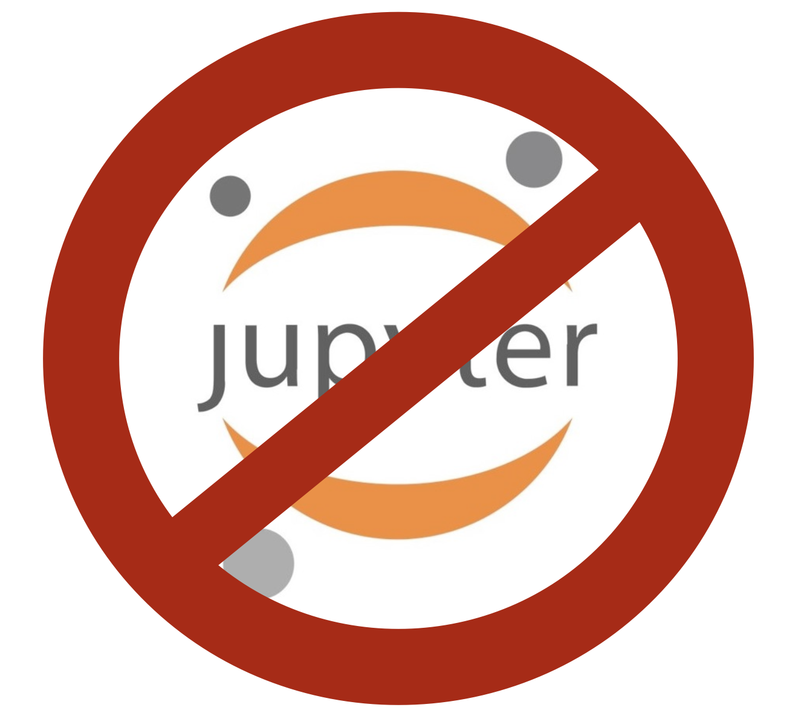

# Programming 4

These pages provide the materials, information, and assignments for the module *Programming 4* for the Master Digital Science for Life Science.

In this module, we focus on the interesting subject [*software engineering for machine learning*](). We will provide some methods and techniques from the field of *software engineering* and see how we can apply those to *data science* (and, by extension, *life sciences*). We delve in quite some depth into *object life-cycle* and *multiple class interaction*, *generators* and *async programming*, *parallellisation*, and *design patterns*. 

Specifically, the module contains the following subjects:

weeknumber | subject(s)
--- | ---
1 | Refresh UML; SOLID; OO en design patterns
2 | Classes and Objects; Constructors and Destructors; Object Lifecycle; Dunders
3 | List Comprehensions; Generators; map-reduce; 
4 | Parallellisation and async programming
5 | Putting it all together

## Assignment

During the course, students will work individually on (more or less) weekly assignments. Every week, students are given time to work on these assignments and will give peer feedback on each other's work. Students can improve their elaboration on basis of this feedback. 

You can find the assignments (all five of them) in the menu on the left.

Make a directory for each of the assignments (`assignment1/`, `assignment2/`, you get the gist). At the end of the term, the collection of all these elaborations will form a portfolio which will be graded. Should the portfolio be considered insufficient, specific repair assignments will be given.

## github

For this module, the use of github is mandatory. All work must be submitted to github in an orderly fashion – having a good and consistent git workflow is part of the requirements for the grade. This includes (but is not necessarily limited to)

- Using a local and remote version of your code base
- Branching and merging at specific points in your developmen cycle
- Writing good and informative commit messages
- Committing often

## No Notebook

Even though we are really a big fan of Jupyter Notebook, in this module use of this tool is strictly forbidden. Writing software for the future means being able to write software that is readable, maintainable and re-usable, software that is ready for production. Thought there is some tooling that makes it possible to put notebooks in production, this is not what they are meant for. The use case for Jupyter Notebooks is exploration and research and in this module we are focussing on software development.

## A note on the use of AI
We expect you to use AI (ChatGPT and image generation tools, at a minimum) in this module. Learning to use AI is an emerging skill and we will provide tutorials about how to do this in an efficient and interesting way.

Be aware of the limits of ChatGPT:

- If you provide minimum effort prompts, you will get low quality results. You will need to refine your prompts in order to get good outcomes. This will take work and practice.

- Don't believe anything it says. If it gives you facts, assume them to be wrong and make sure you check them in some other way or reference. You will be responsible for any errors or omissions provided by the tool.

- AI is a tool, but one that you need to acknowledge using. Please include a paragraph at the end of any assignment that uses AI explaining what you used the AI for and what prompts you provided it with. Have a look at [this page at apa.org](https://apastyle.apa.org/blog/how-to-cite-chatgpt) to get an idea about how to reference to ChatGPT.

- Be thoughtful about when this tool is useful. Don't use it if it isn't appropriate for the case or for the circumstances.

<!-- ## Example code bases -->

<!-- ## Example report -->

