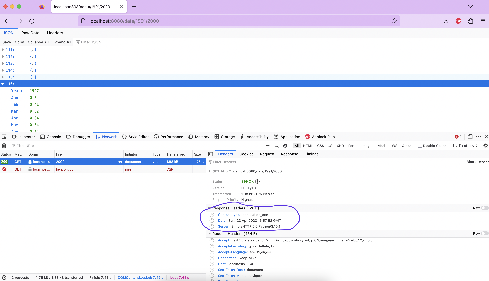

# Week 2.1: Network operations 

## Introduction
In this week, we are going to serve data over the network. It is very improbable that you will do all of your calculations on your own machine, as it can take up a lot of time and resources. That is why we outsource the computation to other machines, so that we only have to wait for the results to come in.

As has been explained, in this scenario we need two types of techniques: client-server architecture and asynchronous programming. During the planairy part both of these have been explained and demonstrated; now it is time to integrate the whole shebang and come up with a complete system.


## Exercise 1: create a server

As has been explained during the plenairy part, you can easily create a (rather rudimentary but good enough for our purposes) server using [Python's http server module](https://docs.python.org/3/library/http.server.html). For easy reference, the most basic setup is repeated below:

```python
PORT = 8080
handler = http.server.SimpleHTTPRequestHandler
http = socketserver.TCPServer(("", PORT), ServerHandler)

print("serving at port", PORT)
http.serve_forever()
```

The idea of this exercise it that we are going to make a server that serves the same wheather-data that we used [in exercise 1.3](week1.3.md). You can find the datafile [using this link](files/dSST.csv). The server will have only one endpoint `/data`, that you can call with either `/all`, `/{year}` or `/{from-year}/{to-year}`:

method | endpoint | status-code | description
----|----|----|----
`GET` | `/data/all` | 200 Ok | Gets all the data in de file
`GET` | `/data/{year}` | 200 Ok | Gets the wheater-data of that particula date
" | " | 404 Not found | if there is no data for that date
" | " | 400 Illegal request | if the `year` is not a year
`GET` | `/data/{from-year}/{to-year}` | 200 Ok | Gives the wheather-date from `from-year` to `to-year` (inclusive)
" | " | 404 Not found | if there is no data for this range
" | " | 400 Illegal request | if either `from-year` or `to-year` is not a year

If a request is done to another endpoint, the server will just respond with a 404.


### step 1: check the request

In the code above, we are using `Python's SimpleHTTPRequestHandler` to handle our requests. Make a new class that extends `SimpleHTTPRequestHandler` so that we can have control over our requests. In this new class, create the method `go_GET` that gets called whenever a GET-request is done to our URI (this is done automatically for you by `http.server`: please [refer to the documentation](https://docs.python.org/3/library/http.server.html#http.server.SimpleHTTPRequestHandler.do_GET)). 

In this method, check the path of the request (using `self.path`) to see whether the request in indeed to `/data`. If this is not the case, respond with a `404 Not found`, using the method `send_error` [that is provided in `SimpleHTTPRequestHandler`](https://docs.python.org/3/library/http.server.html#http.server.BaseHTTPRequestHandler.send_error). Next, check whether the request ends with `/all` or contains one or two dates. If this is not the case, we respond with a `400 Bad Request` error.

### step 2: create the data-provider

In order to separate the http request-handling from the data-handling, you need to create a new class `DataProvider`, which is responsible for (you guessed it) providing the data. Give this class a method that contains a parameter on basis of which all or a piece of the wheather data is returned. So this method should give all the data back when it is called with `all` as a parameter, one line of data when this method is called with only one year for this parameter, and a list of data when it is called with a tuple of two years. Have a look at the code below to get an idea of the workings of this method.

If the parameter does not comply to the requirements stated above, it should raise a `ValueError`. You can use pandas for this class. For now, the method should return a json string.

!!! Info "Transpose the json"
    When using `to_json` in pandas, the returned json is somewhat strange: it uses the index of the DataFrame as a key for every value. In order to make the json more logical, you can [transpose the DataFrame](https://pandas.pydata.org/pandas-docs/stable/reference/api/pandas.DataFrame.transpose.html) before you call `to_json`.

```python
    d = DataProvider()
    print(d.get_data()) # returns all the data in de csv as one json-stream
    print(d.get_data(1991)) # returns one line of data; the one that corresponds to the year 1991 (line 113)
    print(d.get_data([1991,2000])) # returns 10 lines of data, from the year 1991 to 2000
```

### step 3: use the data-provider in the request handler

Now, use this data-provider in the request handler so that its method is called in the correct manner. This means that you need to check the format of the request in your `go_GET` method and call the data-provider method in the appropriate corresponding manner. If the data-provider raises a `ValueError`, you need to respond with status-code 400 again.

Make sure your server responds with a `Status-Code` of 200 and a `Content-Type` header with value `application/json`. You can use your browser to check the results; just make sure you have the inspector tools open in order to check the headers that your server returns. Alternatively, you can use `curl -i` to achieve the same result.



## Exercise 2: create an async client

Now, we are going to create a client that calls the end points of the server we have defined above and consumes the results. Make at least two different functions that can operate on the data – you can use [the same methods you have created in exercise 1.3](week1.3.md#step-2-consuming-the-data), or create another interesting metrics for this wheather data. These functions need to *return* something (like a `dict` with average temperatures, for example). 

Create a class `NetworkClient` that receives the base-url of the server on its initialization (most likely this will be something like `http://localhost:8000/data/`). Provide this class with a method that receives an endpoint from which to fetch the data, and a function that needs to be called when the data has been received. Make sure that this function is non-blocking (in other words, make it an `async def` and provide `awaits` where necessary). Have this method return whatever the provided function returns and use that return value in some kind of visualisation (just a dump on the command line will suffice).

Finally, create list of several calls to this method and use `asyncio.gather` to run these calls. Have a look at the example code below to get an idea of the workings:

```python
async def main():
    tasks = [
        demo_delay(1),
        get_data('http://jsonplaceholder.typicode.com/todos/1', print_data),
        demo_delay(2),
        get_data('http://jsonplaceholder.typicode.com/todos/2', print_data),
        demo_delay(3),
    ]
    await asyncio.gather(*tasks)

if __name__ == '__main__':
    asyncio.run(main())

```

