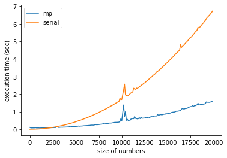
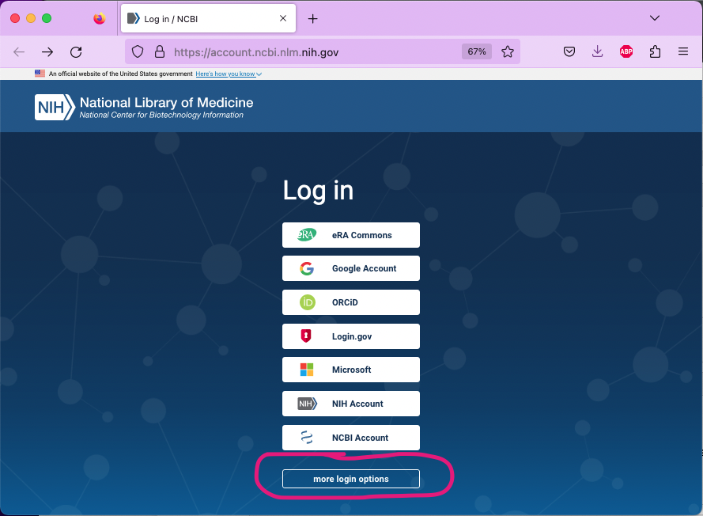
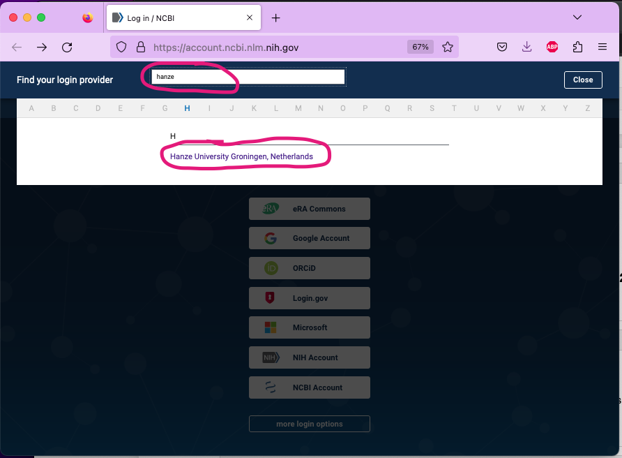
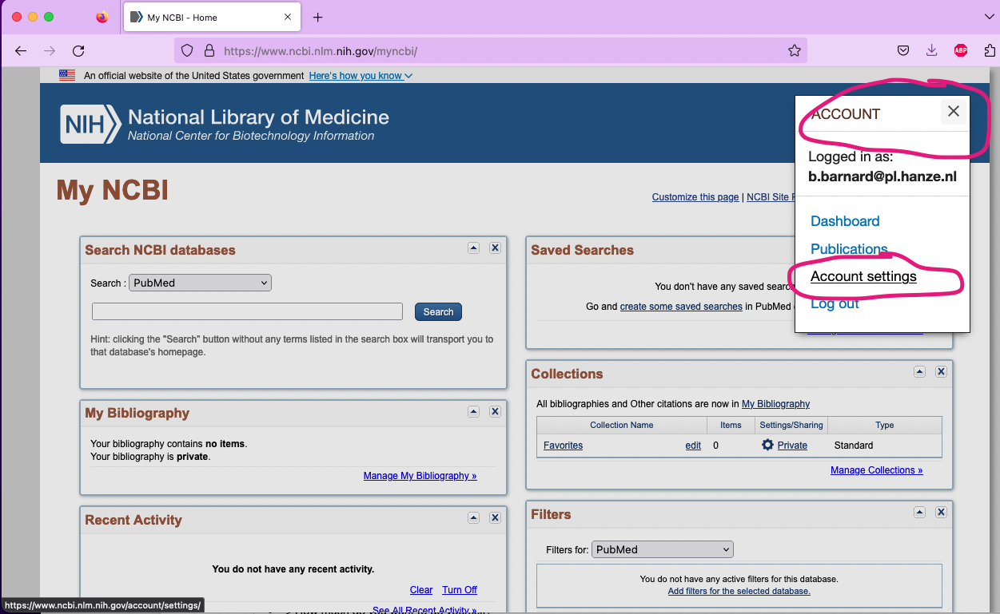
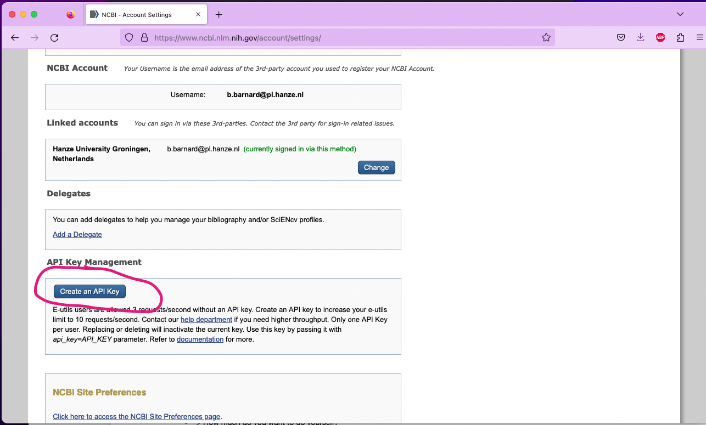
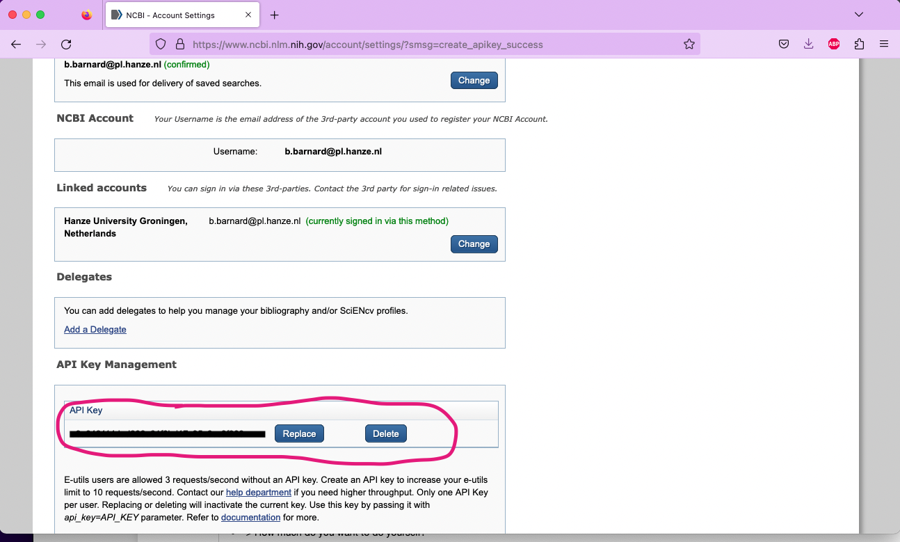

# Week 4: Parallellisation

## Introduction

In the plenairy part we have discussed how you can make use of Python's [`multiprocessor` module](https://docs.python.org/3/library/multiprocessing.html) to distribute the computation of your problem over multiple cores on your CPU. We have seen how this increased performances when you are working with a lot of data, or when you need to do complex calculations.



Even though the `multiprocessor` module is quite complex, the basic workings of it is quite simple. You provide your code with the number of cores you wish to use, some data you want to work with and a function that needs to be called for all the elements of your data. You use [the function `map`](https://docs.python.org/3/library/functions.html#map) for this minimal working example. For easy reference, the relevant portion of the code of the plenairy part is repeated below:

```python
import multiprocessor as mp
with mp.Pool() as p:
    res = p.map(sum_squared, numbers)
```

In this exercise we are going to make use of [the biopython package](https://biopython.org/) to harvest the first ten references quoted by a random article [on the National Center for Biotechnology Information](https://www.ncbi.nlm.nih.gov/). Because harvesting and saving files can be a time consuming process, it makes sense use multiple cores for this task.

## step 0: obtaining an API key

Alas, since a few years having an API key is required to automatically download articles from the NCBI; such a key enables a data-provider to monitor who is using what data. However, it is good to practice this procedure, since you will no doubt come across this at other times in your career. You don't need to program anything for this step: we will just guide you throught it.

Go to [the signin-page of the NBCI](https://www.ncbi.nlm.nih.gov/myncbi/), scroll down a little bit until you see the button `more login options`. Click on that button and on the next page search for 'Hanze'; you will see an option to log in with your Hanze account (which is basically a Microsoft account). Log in with your Hanze credentials:





Once you are logged in, click on your profile image in the top right corner and in the drop-down that appears select `Account settings`. Scroll down a little bit until you see a button `Create an API Key`.





When you click this button, your API key is generated and displayed. Copy this string and save it on a convenient place: you will need to provide this key for every request to the NCBI.




## step 1: install and use the biopython package

As said, in this exercise we are going to use the [biopython package](https://biopython.org/). You can just `pip install` this package and start working with it. Biopython is a very useful, but very HUGE library on dealing with biomedical data. Because this assignment really is meant to get you to use the multiprocessing facilities, rather than trying to teach you to use Biopython itself, we will provide you with the necessary code that you can tinker to fullfill the assignment. However, we urge you to study the package in its totality, as it will surely come in handy at times.

Specifically, we will be using [the `Entrez` class](http://biopython.org/DIST/docs/tutorial/Tutorial.html#sec144) of the library. This class is an API to [the query and database system of the NBCI](https://www.ncbi.nlm.nih.gov/books/NBK25497/). It can be used to query all kinds of databases and systems. Have a look at the code below to see how we can query the pubmed database for a specific article (one with an id of `'30049270"'` (note: the id's are strings)):

```python
from Bio import Entrez

# the next two lines are needed to create an environment in which the 
# ssl doesn't complain about non-existing public keys...
import ssl
ssl._create_default_https_context = ssl._create_unverified_context

#enter your email here; the one you used to create an api key in step 0
Entrez.email = '' 

file = Entrez.elink(dbfrom="pubmed",
                   db="pmc",
                   LinkName="pubmed_pmc_refs",
                   id="30049270",
                   api_key='<YOUR API KEY HERE>'
results = Entrez.read(file)
print (results)
```

In this case, we use [`elink`](http://biopython.org/DIST/docs/tutorial/Tutorial.html#sec150); this doesn't give us the whole article, but only information that is *related* to the article. We can, for example, use this to get all the `ID`s of all the articles that are referenced in this one:

```python
references = [f'{link["Id"]}' for link in results[0]["LinkSetDb"][0]["Link"]]
print (references)
```

If we wanted to obtain the article with authors and abstract, we should have used [`efetch`](http://biopython.org/DIST/docs/tutorial/Tutorial.html#sec149). In the code below, we receive all the information of the article in question in xml-format:

```python
handle = Entrez.efetch(db="pubmed",
                id='30049270',
                retmode="xml",
                api_key='<YOUR API KEY HERE>')
print(handle.read())
```

## step 2: download the referenced articles

With the examples above, you should be able to perform the exercise itself. Make use of the `Entrez` class to obtain the ten first references of an article. You need to be able to provide your script with pubmed id. Your script will look up the references of that article and download the full record of the first ten of these (in xml format). It needs to save these ten full records on your file system, with the id of the reference as its filename (and `xml` as its extension). So if I were to run your script with pumed-id `'30049270'`, the listing of the directory would look somewhat like the following (of course, your hostname, username and path will differ from ours):

```shell
(masterdt) baba@grisea Exercise % ls -l
total 136
10013231.xml
10023427.xml
10029973.xml
9788541.xml
9821373.xml
9843110.xml
9884887.xml
9892353.xml
9970664.xml
9983048.xml
(masterdt) baba@grisea Exercise % 
```

You must use the `multiprocessor` package for the download of these articles. 

## extra challenge

If you want and have some time to spare, try to do the same exercise without the `multiprocessor` package. use `time` to measure the time it took to execute both versions; do you see a difference?


