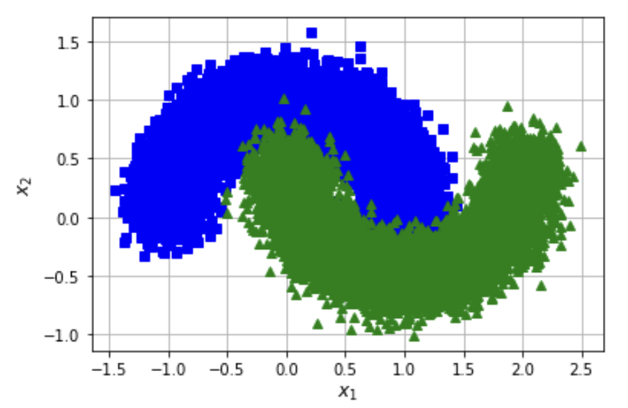

# Week 2.3: Dask

## Introduction

This week and the next, we are talking about [Dask](https://docs.dask.org/en/stable/): a flexible library for parallal computing in Python. The first part of this two-part invention we are working on our own computer; the second part we will look into methods of making use of the network to really distribute our calculations. The exercises of this week are just meant to get some hands-on experience with Dask, so the elaborations do not form part of your graded portfolio.

You need to install Dask using conda or pip; have look [at the documentation](https://docs.dask.org/en/stable/install.html) to see how that is done. Also, for the second part of this exercise we are going to work with [`dask_ml`](https://ml.dask.org/install.html), so you can perhaps install that while you're at it. We also make use of [`sklearn`](https://scikit-learn.org/stable/index.html), so in case you haven't done already you should install this as well.

## Excercise 1: from pandas to dask DataFrame

In this notebook, you will be working with the New York City Airline data. This dataset is only about 200MB, so that you can download it in a reasonable time, but `dask.dataframe` will scale to  datasets **much** larger than memory. Download and run the [prep.py-script](files/prep.py), either in a Notebook or from the command line. This little script will download ten csv-files that make up the Airline data. Have a look at one of them to get an idea of how they look. 

As we have demonstrated during the plenary part, you need to setup a local cluster for Dask to work with. The relevant code is repeated below. Run this code and open a browser window to the link that is will provide.

```python
from dask.distributed import Client

client = Client(n_workers=4)
client
```

Read all the flights-data that you have just downloaded in a [`Dask dataframe`](Dask DataFrame — Dask documentation) – by convention they are called `ddf` (instead of `df` for regular Pandas `dataframe`s). You should use `read_csv` as you are used to, but this time use it on your *Dask* dataframe. What happens when you do `ddf.head()` and can you explain the difference with a regular pandas `dataframe`? Also, use `ddf.visualise()` to get an idea of what the dataframe looks like.

As is explained during the plenary part, you need to call `compute()` in orde to actually *do* something with the data in your `ddf`. Some functions, such as `len()` or `head()` implicitely trigger a call to `compute()` (can you imagine why?). However, in this particular case when you call `ddf.tail()`, the system will respond with an error.

Unlike `pandas.read_csv` which reads in the entire file before inferring datatypes, `dask.dataframe.read_csv` only reads in a sample from the beginning of the file (or first file if using a glob). These inferred datatypes are then enforced when reading all partitions.

In this case, the datatypes inferred in the sample are incorrect. The first `n` rows have no value for `CRSElapsedTime` (which pandas infers as a `float`), and later on turn out to be strings (`object` dtype). Note that Dask gives an informative error message about the mismatch. When this happens you have a few options:

- Specify dtypes directly using the `dtype` keyword. This is the recommended solution, as it's the least error prone (better to be explicit than implicit) and also the most performant.
- Increase the size of the `sample` keyword (in bytes)
- Use `assume_missing` to make `dask` assume that columns inferred to be `int` (which don't allow missing values) are actually `floats` (which do allow missing values). In our particular case this doesn't apply.

Use the first option and specify the correct datatypes for `TailNum`, `CRSElapsedTime` and `Cancelled`:

```python
ddf = dd.read_csv(
    os.path.join("data", "nycflights", "*.csv"),
    parse_dates={"Date": [0, 1, 2]},
    dtype={"TailNum": str, "CRSElapsedTime": float, "Cancelled": bool},
)
```

Now, use your pandas-knowledge to aswer the questions below. Don't forget to have the client-status-window open so that you can see what is happening. Remember you have to call `compute()` in order to actually get the results...

1. In total, how many non-canceled flights were taken from each airport?
2. What was the average departure delay from each airport?
3. Per airport, what day of the week has the worst average departure delay?
4. What are the busiest hours?

## Exercise 2: Dask_ML

### step 1: use dask as a backend

The second part of these exerises are about [`dask_ml`](https://ml.dask.org/install.html). Again, this is more in order to get some hands-on experience using the library. Begin by creating a new client and opening that in a new window. 

We start by using [`GridSearchCV`](https://scikit-learn.org/stable/modules/generated/sklearn.model_selection.GridSearchCV.html) to determine the best parameters for a Support Vector Classifier to classify some random data. Have a look at the code below:

```python
X, y = make_classification(n_samples=1000, random_state=0)
param_grid = {"C": [0.001, 0.01, 0.1, 0.5, 1.0, 2.0, 5.0, 10.0],
              "kernel": ['rbf', 'poly', 'sigmoid'],
              "shrinking": [True, False]}

grid_search = GridSearchCV(SVC(gamma='auto', random_state=0, probability=True),
                           param_grid=param_grid,
                           return_train_score=False,
                           cv=3,
                           n_jobs=-1)

grid_search.fit(X, y)
```

Scikit-learn uses [joblib](http://joblib.readthedocs.io/) for single-machine parallelism. This lets you train most estimators (anything that accepts an `n_jobs` parameter) using all the cores of your laptop or workstation. 

Alternatively, Scikit-Learn can use Dask for parallelism. This lets you train those estimators using all the cores of your cluster without significantly changing your code. In that case, you have to provide the string `dask` to the method [parallel_backend](https://joblib.readthedocs.io/en/latest/parallel.html#joblib.parallel_backend). Again, have the client-status-window open in order to monitor the workings.

```python
import joblib

with joblib.parallel_backend('dask'):
    #YOUR CODE HERE

```

In either case, you can use the `cv_results_`-property of the trained model to investigate the best parameters for the classification (even though that is not really the purpose for this exercise). Use `pd.DataFrame(grid_search.cv_results_)` to put the results in a dataframe.

### step 2: classify with `dask_ml`

In this last exercise, we will create a classifier based on a [sklearn moon-dataset](https://scikit-learn.org/stable/modules/generated/sklearn.datasets.make_moons.html). Download the file [`moons-csv](files/moons-data.csv) and load this in a pandas dataframe. Create a numpy matrix `X` on basis of the first two column of this dataframe, and a number array `y` on basis on the third. The `X` holds our data and our `y` the classes.

Use [`sklearn.model_selection.train_test_split()`](https://scikit-learn.org/stable/modules/generated/sklearn.model_selection.train_test_split.html#sklearn.model_selection.train_test_split) to split the data in two seperate parts, with 80% trainings-data and 20% test-data. Make two logistic regressors, one from [`sklearn`](https://scikit-learn.org/stable/modules/generated/sklearn.linear_model.LogisticRegression.html) and one from [`ml_dask`](https://ml.dask.org/modules/generated/dask_ml.linear_model.LogisticRegression.html). 

Train both of these regressors on the trainings-data and check their validity on basis of the test-data. Experiment with different values for the hyperparameters. Do you see a difference between the results? 

Lastly, plot a scatter-plot of the test-data including the classes (either predicted of actual).




