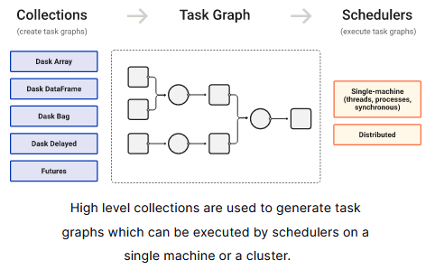

# Week 2.5: Real world Dask

As mentioned previously, Dask is a library for parallel computing in Python. It is based on Pandas and uses the same interface. It is especially helpful for big data collections as it is able to create parallel collections that run on top of dynamic task schedulers.

Make sure to go through the <a href="https://docs.dask.org/en/stable/api.html" target="_blank">documentation</a> and have this side by side when doing the exercises..

## Introduction

The goal of this assignment is to read in a large dataset of protein annotation information and to manipulate, summarize and analyze it using Dask Dataframes.

Protein annotation is a branch of bioinformatics which classifies the different parts of a protein's structure based on both sequence and functional characteristics. For instance, it recognizes structural elements like trans-membrane helices, but also particular active sites ("Serine Protease") and also signal peptides ("periplasmic membrane tag"). The holy grail of this field is to use these different annotations of parts of the protein sequence, and to combine them to predict the function of the protein as a whole, without having to carry out actual experiments in the lab.

The subject is the output of the InterProScan protein annotation service [InterproScan online](http://www.ebi.ac.uk/interpro/), [NAR article](https://academic.oup.com/nar/article/49/D1/D344/5958491). Briefly, InterPROscan is a meta-annotator: it runs different protein function annotators in turn on an input amino-acid sequence FASTA file and collects the output of each, labelling them with a unique and consistent identifier – the "InterPRO number". This service is used to annotate all currently known prokaryotic (Bacteria, Archaea) genomes to investigate better methods of metagenomics sequence annotation.

An explanation of the data can be found <a href="https://interpro-documentation.readthedocs.io/en/latest/interproscan.html" target="_blank">here</a>

# 2. Deliverables

Write a script that reads in a InterPROscan output file and answers the questions below. You can test your script on the data-file that you can find at `/data/dataprocessing/interproscan/all_bacilli.tsv` file on assemblix2012 and assemblix2019. You must use the Dask Dataframe interface to read in and manipulate this file. This file contains ~4,200,000 protein annotations and is around 11GB.

1. How many distinct protein annotations are found in the dataset? I.e. how many distinc InterPRO numbers are there?
2. How many annotations does a protein have on average?
3. What is the most common GO Term found?
4. What is the average size of an InterPRO feature found in the dataset?
5. What is the top 10 most common InterPRO features?
6. If you select InterPRO features that are almost the same size (within 90-100%) as the protein itself, what is the top10 then?
7. If you look at those features which also have textual annotation, what is the top 10 most common word found in that annotation?
8. And the top 10 least common?
9. Combining your answers for Q6 and Q7, what are the 10 most commons words found for the largest InterPRO features?
10. What is the coefficient of correlation ($R^2$) between the size of the protein and the number of features found?

Notes:
- InterPRO annotations are accession numbers, e.g. IPRO002093)
- If a value is missing, a `-` is displayed.
- One cell can contain multiple GO annotations divided by `|`

NB1: Make sure you use the `/commons/conda` environment

NB2: Do *not* download the file on your local machine, but work on it from the server. You can configure VSCode on your machine to connect (via ssh) to assemblix2019. 

NB3: Use only 16 threads maximum: `dask.dataframe.compute(num_workers=16)`
