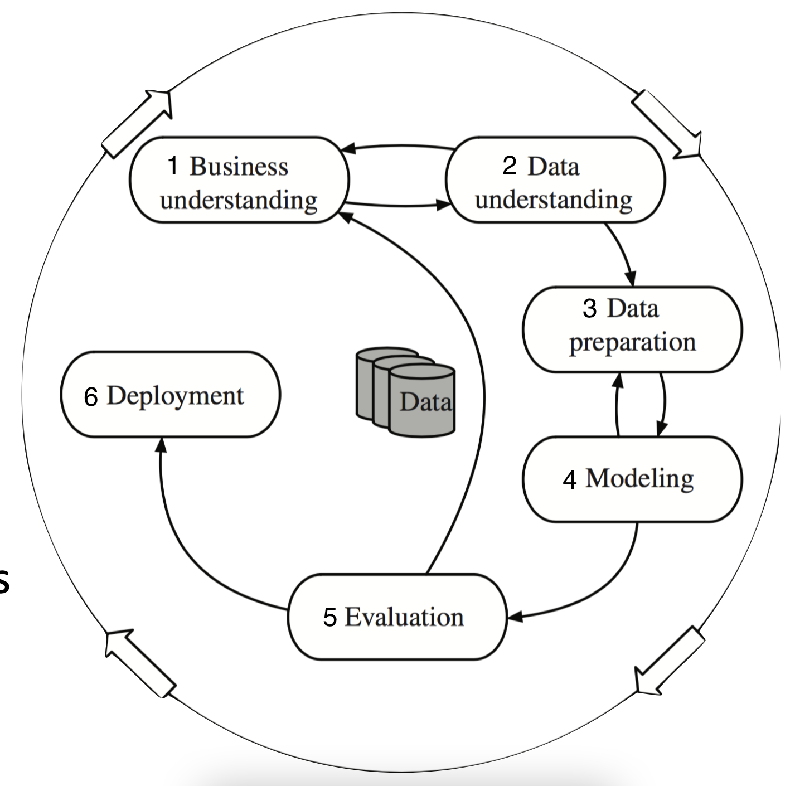
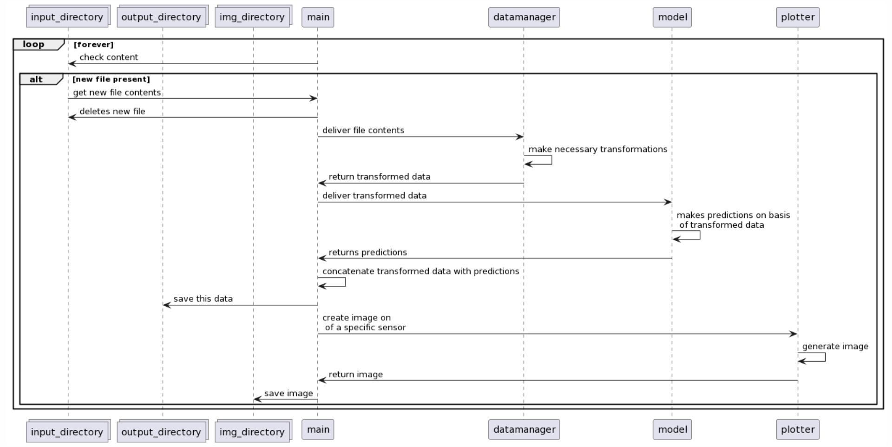

# Week 2.7: SE4ML (2)

## Introduction

Last week, we discussed the problems and challenges that occur when you are working on a software project. Though the focus at the time was at relatively large scale project, with a code base the size of which you're unlikely to encounter in the domain of life sciences, it would be wise to apply the lessons learned in general software engineering in any software project.

In this last assignment, you are asked to do exactly that. You are going to develop a small pipeline with several interacting components that work independent of each other. During the development, you need to take into account all the things we talked about in this module.

The application you are going to make, makes use of a *trained* machine learning model, so this assignment is kind of an integration of DS3 with Programming 2. Have a look at the general machine learning development cycle below. Though we will go through all the steps, the focus will be on steps 3, 4, 5 and 6.



## Step 1: getting and transforming the data

For this exercise, we are elaborating on the anomaly detection study case that [is part of the unsupervised part of DS3](https://github.com/fenna/BFVM23DATASCNC5/blob/main/Study_Cases/Study_Case_Anomaly_Detection.ipynb). Head over to that notebook, study its contents and ownload the dataset.

!!! Info "Use your own dataset"
    You can also use your own dataset, but only if it fulfills the following requirements:

    - There is a *logical (ontological, domain-specific) reason* why this dataset grows over time, e.g. when more images become available every month, or new prices of something are published every day, or new network connections are delivered every week;
    - The data you already have is *large enough* (contains enough instances) to be split along the lines described above, i.e. you must be able to *train* a model on roughly three-fifth of the dataset and test the complete pipeline at least twice on the remaining splits;
    - In order for the model to work correctly, the data needs some kind of *non trivial transformation*, like removing outliers, or merging, dropping or calculating columns;
    - Every run of the model on new data should result in an interesting plot of the data.


The dataset contains sensor data from 1 April to 31 August 2018. We're going to train the model on the months April, May, and June and then use the trained model to predict the anomalies of the months July and August. Split the original dataset among these lines, so that eventually you have three files. We use the first of these to actually train the model, and then feed the second and third files to this persisted model sequentially.

## Step 2: create the model and the drawer

Using the first of the three splits described above, train one of the models from the notebook, or use your own realisation. Note that in order to do this training, some data-transformations are necessary. Isolate these relevant transformations, so that they can be performed later on the two remaining sets. Train the model on the transformed dataset.

!!! Warning "Transform only the training-data"
    For this exercise, it is imparitive that you perform the data-transformations *after* you split the original data and *only* on the training-data. In this way, we can correctly simulate the entering of future data in our pipeline.

Make sure you state something about the performance of the model, in the terms we have discussed earlier. Use one of the techniques [described on scikit-learn.org](https://scikit-learn.org/stable/model_persistence.html) to persist the model on your local file system. 

Study the method `plot_sensor_anomolies(sensor, name)` that you can find in the notebook. In the current setup, this method can only work if the dataframe `df` is defined within the scope of the complete notebook (so only if `df` is a *global variable*). Refactor this method so that is *independent* of any global variables (global variables are bad news in general). Also, change its functionality so that it *returns* the plot instead of displaying it.


## Step 4: listening for new data

Now that we have trained and saved our model, it is time to put it into production. For this to work, we are going to make another class that looks at a specific directory. When a new data file is uploaded to this directory, this class will load the data in that file, apply the necessary changes and use our model to predict new new values. It then saves the transformed data with the predictions in another directory and removes the original data file. 

Apart from saving the transformed and enriched data, it will also create images of certain sensors and save those in the `img` directory – their filename displaying both the sensor and the timestamp. Have a look at the sequence diagram below to get an idea of what is happening.



The whole process need to be logged in a log-file. A typical run will produce the following lines in this log-file:

```shell
2023-06-11 10:09:32  Found new data file
2023-06-11 10:09:32  Loaded the file 
2023-06-11 10:09:34  Received transformed data
2023-06-11 10:09:38  Received predicions
2023-06-11 10:09:38  Saving predictions
2023-06-11 10:09:40  Saving image2 2018-07-sensor04.png
2023-06-11 10:09:40  Saving image2 2018-07-sensor51.png
2023-06-11 10:09:40  Resuming listening
```

If the new file in the `input`-directory does not contain data that is eligable for the system, an error needs to be logged to the log-file. This should, however, not break the running of the application.


Test your realisation with the two separate data files you have created – the ones containing the data for July and for August: when you put one of them in the `input`-directory, the whole cycle should start and create a new data file in the `output`-directory and a new image in the `img`-directory.

!!! Warning "Technical requirements"

    - all files and classes should be *independent* of each other: they should adhere to [the SOLID-principles](week1.1.md).
    - the application should make use of a file `application.json` in which the following settings are present:

        - the location of the `input`-directory
        - the location of the `output`-directory
        - the location of the `img`-directory
        - the names of the sensors that needs to be drawn
        - the interval (in seconds) with which the `input`-directory is checked for new files 

